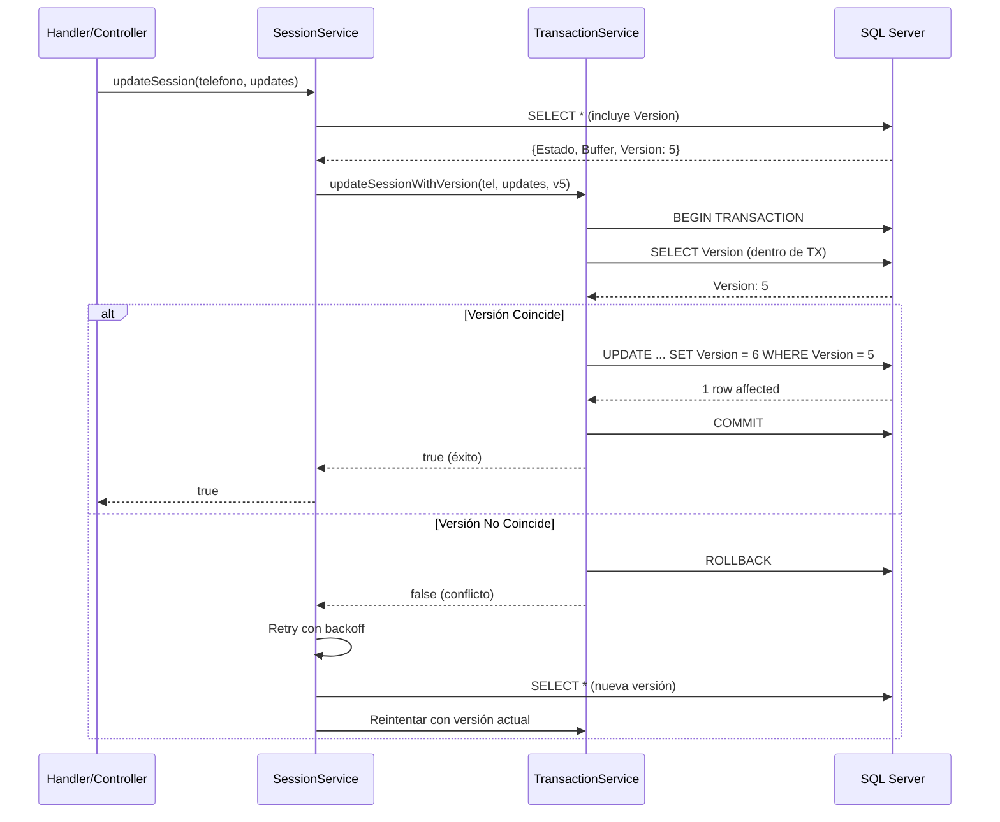

# Control de Concurrencia con Optimistic Locking

## 📋 Resumen

Se implementó un sistema robusto de control de concurrencia usando **Optimistic Locking** con columnas de versión para prevenir condiciones de carrera y pérdida de datos cuando múltiples procesos intentan actualizar simultáneamente sesiones de conversación o pedidos.

## 🎯 Problema Resuelto

### Escenario de Race Condition
Cuando dos mensajes de WhatsApp llegan simultáneamente del mismo usuario:

```
Tiempo  | Proceso 1                | Proceso 2
--------|--------------------------|---------------------------
T1      | Lee sesión (v0)          |
T2      |                          | Lee sesión (v0)
T3      | Modifica Estado → NOMBRE |
T4      |                          | Modifica Estado → DIRECCION
T5      | Escribe sesión           |
T6      |                          | Escribe sesión (⚠️ sobrescribe P1)
```

**Resultado sin Optimistic Locking**: Los cambios del Proceso 1 se pierden.

## ✅ Solución Implementada

### 1. Columnas de Versión (Migration 09)
**Archivo**: `migrations/09_version_control.sql`

```sql
ALTER TABLE Conversaciones 
ADD Version INT NOT NULL DEFAULT 0;

ALTER TABLE Pedidos 
ADD Version INT NOT NULL DEFAULT 0;

CREATE INDEX IX_Conversaciones_NumeroTelefono_Version 
ON Conversaciones(NumeroTelefono, Version);
```

### 2. Transaction Service
**Archivo**: `src/services/transactionService.js`

Proporciona funciones atómicas con manejo de deadlocks y optimistic locking:

```javascript
export async function updateSessionWithVersion(telefono, updates, expectedVersion) {
  return await executeInTransaction(async (transaction) => {
    // 1. Leer versión actual
    const current = await transaction.request()
      .input('telefono', sql.NVarChar, telefono)
      .query('SELECT Version FROM Conversaciones WHERE NumeroTelefono = @telefono');
    
    const currentVersion = current.recordset[0].Version;
    
    // 2. Verificar versión (optimistic lock)
    if (currentVersion !== expectedVersion) {
      logger.warn('⚠️ Conflicto de versión detectado para %s. Esperada: %d, Actual: %d',
                 telefono, expectedVersion, currentVersion);
      return false; // ❌ Conflicto - otro proceso modificó la sesión
    }
    
    // 3. Actualizar con nueva versión
    const result = await transaction.request()
      .input('telefono', sql.NVarChar, telefono)
      .input('newVersion', sql.Int, currentVersion + 1)
      .input('expectedVersion', sql.Int, expectedVersion)
      .query(`UPDATE Conversaciones 
              SET Estado = @estado, 
                  Buffer = @buffer, 
                  Version = @newVersion,
                  UltimaInteraccion = SYSDATETIME()
              WHERE NumeroTelefono = @telefono 
                AND Version = @expectedVersion`);
    
    return result.rowsAffected[0] > 0; // ✅ Éxito
  });
}
```

**Características**:
- ✅ Transacciones automáticas con rollback
- ✅ Retry en caso de deadlock (SQL error 1205)
- ✅ Backoff exponencial: 200ms → 400ms → 800ms
- ✅ Logging detallado de conflictos

### 3. Session Service con Retry
**Archivo**: `src/services/sessionService.js`

Refactorizado `updateSession()` para usar optimistic locking con retry automático:

```javascript
updateSession: async (telefono, updates) => {
  const MAX_RETRIES = 3;
  let attempt = 0;
  
  while (attempt < MAX_RETRIES) {
    attempt++;
    
    // Leer sesión con versión actual
    const current = await pool.request()
      .input('telefono', sql.NVarChar, telefono)
      .query('SELECT * FROM Conversaciones WHERE NumeroTelefono = @telefono');
    
    const currentVersion = current.recordset[0].Version;
    
    // Validaciones de transición de estado...
    
    // Intentar actualización con optimistic locking
    const success = await updateSessionWithVersion(telefono, updates, currentVersion);
    
    if (success) {
      logger.debug('✅ Sesión actualizada (intento %d/%d)', attempt, MAX_RETRIES);
      return true;
    } else {
      logger.warn('⚠️ Conflicto de versión en intento %d/%d', attempt, MAX_RETRIES);
      
      if (attempt >= MAX_RETRIES) {
        throw new Error(`Conflicto de concurrencia después de ${MAX_RETRIES} intentos`);
      }
      
      // Backoff exponencial antes de reintentar
      const delay = Math.pow(2, attempt - 1) * 100; // 100ms, 200ms, 400ms
      await new Promise(resolve => setTimeout(resolve, delay));
    }
  }
}
```

### 4. Dashboard Controller
**Archivo**: `src/controllers/dashboardController.js`

Funciones `updateEstadoPedido()` y `updateEstadoPedidoNuevo()` actualizadas:

```javascript
export async function updateEstadoPedido(req, res) {
  const MAX_RETRIES = 3;
  let attempt = 0;
  
  while (attempt < MAX_RETRIES) {
    attempt++;
    
    // Leer pedido con versión
    const pedidoResult = await pool.request()
      .input('pedidoId', sql.Int, parseInt(pedidoId))
      .query('SELECT PedidoID, Estado, Version FROM Pedidos WHERE PedidoID = @pedidoId');
    
    const currentVersion = pedidoResult.recordset[0].Version;
    
    // Actualizar con optimistic locking
    const success = await updatePedidoEstadoWithVersion(
      parseInt(pedidoId), 
      estadoFinal, 
      currentVersion,
      notas
    );
    
    if (success) {
      return res.json({ success: true, message: 'Estado actualizado correctamente' });
    } else {
      // Retry con backoff...
      if (attempt >= MAX_RETRIES) {
        return res.status(409).json({ 
          success: false, 
          error: 'Conflicto de concurrencia. Por favor, recargue e intente de nuevo.' 
        });
      }
    }
  }
}
```

## 🧪 Tests de Validación

**Archivo**: `scripts/test-concurrency.js`

Suite de 4 tests automatizados:

### Test 1: Actualización Exitosa
- ✅ Crea sesión con Version=0
- ✅ Actualiza con versión correcta
- ✅ Verifica que Version se incrementa a 1

### Test 2: Conflicto Detectado
- ✅ Crea sesión (v0)
- ✅ Primera actualización exitosa (v0→v1)
- ✅ Segunda actualización con v0 **falla** (conflicto detectado)

### Test 3: Concurrencia con Retry
- ✅ Simula dos procesos leyendo v0
- ✅ Proceso 1 actualiza primero (éxito)
- ✅ Proceso 2 falla con v0 (conflicto)
- ✅ Proceso 2 reintentar con v1 (éxito)

### Test 4: Actualizaciones Consecutivas
- ✅ Realiza 10 actualizaciones rápidas
- ✅ Verifica que todas se apliquen (sin pérdida de datos)
- ✅ Version final = 10

**Resultado**: 🎉 **4/4 tests pasaron**

```bash
node scripts/test-concurrency.js
```

## 📊 Flujo de Actualización



## 🔒 Garantías del Sistema

1. **Atomicidad**: Todas las actualizaciones son transaccionales
2. **Consistencia**: Las versiones siempre se incrementan secuencialmente
3. **Aislamiento**: Detecta modificaciones concurrentes
4. **Durabilidad**: Los commits garantizan persistencia

## 🚀 Mejoras de Rendimiento

- **Índice Compuesto**: `(NumeroTelefono, Version)` para búsquedas rápidas
- **Sin Row Locks**: No bloquea filas, permite alta concurrencia en lectura
- **Backoff Exponencial**: Reduce contención en retries
- **Retry Limitado**: Máximo 3 intentos previene loops infinitos

## 📈 Métricas de Logging

```javascript
// Éxito
logger.debug('✅ Sesión actualizada (intento %d/%d): %s', attempt, MAX_RETRIES, telefono);

// Conflicto detectado
logger.warn('⚠️ Conflicto de versión en intento %d/%d para: %s (esperado v%d)', 
           attempt, MAX_RETRIES, telefono, expectedVersion);

// Fallo crítico
logger.error('🚨 FALLO después de %d intentos - conflicto de concurrencia: %s', 
            MAX_RETRIES, telefono);
```

## 🔄 Comparación: Antes vs Después

### ❌ ANTES (Sin Control de Concurrencia)
```javascript
// ⚠️ PELIGRO: Race condition
await pool.request()
  .input('telefono', sql.NVarChar, telefono)
  .input('estado', sql.NVarChar, nuevoEstado)
  .query('UPDATE Conversaciones SET Estado=@estado WHERE NumeroTelefono=@telefono');
// 💥 Actualizaciones concurrentes pueden sobrescribirse
```

### ✅ DESPUÉS (Con Optimistic Locking)
```javascript
// 🔒 SEGURO: Detecta conflictos
const success = await updateSessionWithVersion(telefono, updates, currentVersion);
if (!success) {
  // Reintentar con versión actualizada
  const fresh = await obtenerSesion(telefono);
  await updateSessionWithVersion(telefono, updates, fresh.Version);
}
// ✅ Garantiza que no se pierden actualizaciones
```

## 🎯 Casos de Uso Protegidos

1. **Múltiples mensajes simultáneos** del mismo cliente
2. **Admin actualiza pedido** mientras bot lo marca como entregado
3. **Timeout de sesión** mientras usuario envía mensaje
4. **Dashboard de múltiples usuarios** modificando el mismo pedido

## ⚠️ Consideraciones de Despliegue

1. **Ejecutar Migration 09**: `node scripts/run-migration.js 09_version_control.sql`
2. **Verificar índices**: Validar que se creó `IX_Conversaciones_NumeroTelefono_Version`
3. **Monitorear logs**: Buscar mensajes de conflicto frecuente (podría indicar contención alta)
4. **Configurar timeout**: Para escenarios de muy alta carga, ajustar `MAX_RETRIES`

## 📚 Referencias

- [Optimistic Locking Pattern](https://en.wikipedia.org/wiki/Optimistic_concurrency_control)
- [SQL Server Transaction Isolation Levels](https://learn.microsoft.com/en-us/sql/t-sql/language-elements/transaction-isolation-levels)
- [Handling Deadlocks in SQL Server](https://learn.microsoft.com/en-us/sql/relational-databases/sql-server-transaction-locking-and-row-versioning-guide)

---

**Estado**: ✅ Completado y probado (Sprint 3 - Tarea 1)  
**Archivos modificados**: 4  
**Tests pasados**: 4/4  
**Fecha**: Enero 2025
