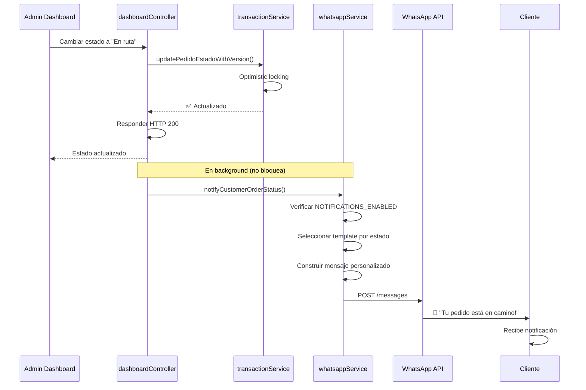

# Notificaciones Automáticas a Clientes

## 📋 Resumen

Sistema de notificaciones automáticas que informa a los clientes sobre cambios en el estado de sus pedidos mediante mensajes de WhatsApp. Mejora la experiencia del usuario y reduce consultas repetitivas sobre el estado de los pedidos.

## 🎯 Problema Resuelto

### Antes de las Notificaciones

```
❌ Cliente: "¿Dónde está mi pedido?"
❌ Cliente: "¿Ya salió de la tienda?"
❌ Cliente: "¿Cuándo llega?"
→ Múltiples mensajes del cliente preguntando lo mismo
→ Sobrecarga del personal de atención
```

### Con Notificaciones Automáticas ✅

```
Admin cambia estado en dashboard: "En ruta"
    ↓
🚚 Notificación automática al cliente:
   "¡Tu pedido está en camino! Pronto llegará a tu dirección."
    ↓
✅ Cliente informado proactivamente
✅ Sin necesidad de preguntar
✅ Mejor experiencia de usuario
```

## 🔔 Estados que Activan Notificaciones

| Estado | Emoji | Mensaje al Cliente |
|--------|-------|-------------------|
| **En espera de surtir** | ⏳ | "Tu pedido ha sido recibido y está en espera de ser surtido." |
| **En ruta** | 🚚 | "¡Tu pedido está en camino! Pronto llegará a tu dirección." |
| **Entregado** | ✅ | "¡Tu pedido ha sido entregado exitosamente! ¡Gracias por tu compra!" |
| **Cancelado** | ❌ | "Tu pedido ha sido cancelado. Si tienes dudas, contáctanos." |

## 🎨 Formato de Mensajes

Los mensajes se envían con formato estructurado:

```
🚚 *Pedido en Camino*

Hola Juan,

¡Tu pedido está en camino! Pronto llegará a tu dirección.

📦 Folio: 123
```

**Características**:
- ✅ Emoji distintivo por estado
- ✅ Título en negrita con formato WhatsApp
- ✅ Personalización con nombre del cliente
- ✅ Mensaje claro y amigable
- ✅ Folio del pedido para referencia

## 🔧 Implementación

### 1. Función de Notificación
**Archivo**: `src/services/whatsappService.js`

```javascript
notifyCustomerOrderStatus: async (telefono, pedidoID, nuevoEstado, nombreCliente = null) => {
  // Verificar si notificaciones están habilitadas
  const notificationsEnabled = process.env.NOTIFICATIONS_ENABLED !== 'false';
  
  if (!notificationsEnabled) {
    logger.debug('📵 Notificaciones deshabilitadas');
    return false;
  }

  // Templates por estado
  const templates = {
    'En espera de surtir': {
      emoji: '⏳',
      title: 'Pedido Recibido',
      message: 'Tu pedido ha sido recibido...'
    },
    'En ruta': {
      emoji: '🚚',
      title: 'Pedido en Camino',
      message: '¡Tu pedido está en camino!...'
    },
    // ... más estados
  };

  // Construir mensaje personalizado
  const saludo = nombreCliente ? `Hola ${nombreCliente},\n\n` : '';
  const mensaje = `${template.emoji} *${template.title}*\n\n${saludo}${template.message}\n\n📦 Folio: ${pedidoID}`;

  // Enviar vía WhatsApp API
  await apiSend({
    messaging_product: 'whatsapp',
    to: telefono,
    type: 'text',
    text: { body: mensaje }
  });

  logger.info('✅ Notificación enviada: Pedido %d → %s', pedidoID, nuevoEstado);
  return true;
}
```

**Características Clave**:
- ✅ No bloquea si falla (catch interno)
- ✅ Logging detallado de éxitos/errores
- ✅ Respeta configuración NOTIFICATIONS_ENABLED
- ✅ Personalización opcional con nombre
- ✅ Retry automático (vía axios-retry configurado)

### 2. Integración en Dashboard Controller
**Archivo**: `src/controllers/dashboardController.js`

```javascript
export async function updateEstadoPedido(req, res) {
  // ... validaciones y optimistic locking ...
  
  const success = await updatePedidoEstadoWithVersion(
    parseInt(pedidoId), 
    estadoFinal, 
    currentVersion,
    notas
  );
  
  if (success) {
    logger.info('✅ Estado actualizado: Pedido %s → %s', pedidoId, estadoFinal);
    
    // 📱 NOTIFICACIÓN AUTOMÁTICA AL CLIENTE
    // Ejecutar en background para no bloquear respuesta
    whatsappService.notifyCustomerOrderStatus(
      pedido.NumeroTelefono,
      parseInt(pedidoId),
      estadoFinal,
      pedido.Nombre
    ).catch(err => {
      // Error ya loggeado en whatsappService
      logger.warn('⚠️ Notificación no enviada (no crítico)');
    });
    
    return res.json({ success: true, message: 'Estado actualizado correctamente' });
  }
  
  // ... manejo de conflictos ...
}
```

**Importante**: La notificación se ejecuta en **background** (sin await) para que:
- ✅ No bloquea la respuesta HTTP al dashboard
- ✅ Actualización del pedido siempre se completa
- ✅ Si falla la notificación, no afecta la operación principal

### 3. Obtención de Datos del Cliente

Se modificó la query SQL para incluir información del cliente:

```sql
SELECT p.PedidoID, p.Estado, p.Version, p.ClienteID,
       c.NumeroTelefono, c.Nombre
FROM Pedidos p
INNER JOIN Clientes c ON p.ClienteID = c.ClienteID
WHERE p.PedidoID = @pedidoId
```

Esto permite enviar notificaciones personalizadas con el nombre del cliente.

## ⚙️ Configuración

### Variable de Entorno

```bash
# .env
NOTIFICATIONS_ENABLED=true
```

**Valores**:
- `true` (default): Notificaciones habilitadas
- `false`: Notificaciones deshabilitadas

### Habilitar/Deshabilitar

**Para deshabilitar temporalmente**:
```bash
# En .env
NOTIFICATIONS_ENABLED=false
```

**Reiniciar servidor**:
```bash
npm start
```

**Logs al iniciar**:
```
📵 Notificaciones deshabilitadas - No se envió notificación para pedido 123
```

## 📊 Flujo Completo



## 🧪 Pruebas

### Test 1: Notificación en Cambio de Estado

**Pasos**:
1. Abrir dashboard → Pedidos
2. Seleccionar un pedido en "En espera de surtir"
3. Cambiar estado a "En ruta"
4. Verificar en logs del servidor

**Resultado Esperado**:
```
✅ Estado actualizado (intento 1/3): Pedido 123 → En ruta
✅ Notificación enviada: Pedido 123 → En ruta (Tel: +5212345678)
```

**En WhatsApp del cliente**:
```
🚚 Pedido en Camino

Hola María,

¡Tu pedido está en camino! Pronto llegará a tu dirección.

📦 Folio: 123
```

### Test 2: Notificaciones Deshabilitadas

**Configuración**:
```bash
NOTIFICATIONS_ENABLED=false
```

**Pasos**:
1. Reiniciar servidor
2. Cambiar estado de pedido

**Resultado Esperado**:
```
✅ Estado actualizado: Pedido 123 → Entregado
📵 Notificaciones deshabilitadas - No se envió notificación para pedido 123
```

### Test 3: Error en API de WhatsApp (No Crítico)

**Escenario**: WhatsApp API caída o token inválido

**Resultado Esperado**:
```
✅ Estado actualizado: Pedido 123 → En ruta
❌ Error enviando notificación de pedido 123 a +5212345678: Request failed with status code 401
   Estado: En ruta
   Response status: 401
⚠️ Notificación no enviada para pedido 123 (no crítico)
```

**Importante**: 
- ✅ El pedido se actualizó correctamente en BD
- ✅ Admin recibe confirmación en dashboard
- ✅ Solo la notificación falló (no crítico)

### Test 4: Múltiples Estados Consecutivos

**Pasos**:
1. Cambiar estado: "En espera de surtir" → "En ruta"
2. Esperar 1 minuto
3. Cambiar estado: "En ruta" → "Entregado"

**Resultado Esperado**:

**Primera notificación**:
```
🚚 Pedido en Camino

Hola Juan,
¡Tu pedido está en camino!...
```

**Segunda notificación** (1 minuto después):
```
✅ Pedido Entregado

Hola Juan,
¡Tu pedido ha sido entregado exitosamente!
¡Gracias por tu compra! Esperamos verte pronto.
```

## 📈 Logs y Monitoreo

### Logs de Éxito
```log
[INFO] ✅ Estado actualizado (intento 1/3): Pedido 456 → Entregado
[INFO] ✅ Notificación enviada: Pedido 456 → Entregado (Tel: +5219876543)
```

### Logs de Notificaciones Deshabilitadas
```log
[DEBUG] 📵 Notificaciones deshabilitadas - No se envió notificación para pedido 789
```

### Logs de Error (No Crítico)
```log
[ERROR] ❌ Error enviando notificación de pedido 123 a +5212345678: Connection timeout
[ERROR]    Estado: En ruta
[ERROR]    Response status: undefined
[WARN] ⚠️ Notificación no enviada para pedido 123 (no crítico)
```

### Logs de Estado Sin Template
```log
[DEBUG] 📵 Sin template de notificación para estado: Procesando (pedido 999)
```

### Métricas Útiles

**Contar notificaciones enviadas hoy**:
```bash
grep "Notificación enviada" logs/*.log | grep "$(date +%Y-%m-%d)" | wc -l
```

**Ver notificaciones fallidas**:
```bash
grep "Error enviando notificación" logs/*.log | tail -20
```

**Tasa de éxito de notificaciones**:
```bash
enviadas=$(grep "Notificación enviada" logs/*.log | wc -l)
errores=$(grep "Error enviando notificación" logs/*.log | wc -l)
echo "Enviadas: $enviadas, Errores: $errores"
```

## 💡 Mejores Prácticas

### 1. No Bloquear Operación Principal
```javascript
// ✅ CORRECTO: Ejecución en background
whatsappService.notifyCustomerOrderStatus(...).catch(err => {
  logger.warn('Notificación fallida (no crítico)');
});
return res.json({ success: true });

// ❌ INCORRECTO: Bloquea respuesta al admin
await whatsappService.notifyCustomerOrderStatus(...);
return res.json({ success: true });
```

### 2. Manejo de Errores Silencioso
```javascript
// En whatsappService.js
try {
  await apiSend(payload);
  logger.info('✅ Notificación enviada');
  return true;
} catch (error) {
  // NO lanzar error - solo loggear
  logger.error('❌ Error enviando notificación:', error.message);
  return false;
}
```

### 3. Verificar Configuración
```javascript
// Siempre verificar NOTIFICATIONS_ENABLED
const notificationsEnabled = process.env.NOTIFICATIONS_ENABLED !== 'false';
if (!notificationsEnabled) {
  return false;
}
```

### 4. Templates Claros y Amigables
```javascript
// ✅ CORRECTO: Mensaje claro, amigable, con acción
message: '¡Tu pedido está en camino! Pronto llegará a tu dirección.'

// ❌ EVITAR: Muy técnico o sin contexto
message: 'Estado actualizado a: EN_RUTA'
```

## 🔄 Personalización de Mensajes

### Modificar Templates

Editar `src/services/whatsappService.js`:

```javascript
const templates = {
  'En ruta': {
    emoji: '🚚',
    title: 'Pedido en Camino',
    message: 'Tu mensaje personalizado aquí...'
  }
};
```

### Agregar Nuevos Estados

Si agregas un nuevo estado de pedido:

```javascript
const templates = {
  // ... estados existentes ...
  'En preparación': {
    emoji: '👨‍🍳',
    title: 'Preparando tu Pedido',
    message: 'Estamos preparando tu pedido con mucho cuidado.'
  }
};
```

### Personalización Avanzada

**Con descuento o promoción**:
```javascript
if (nuevoEstado === 'Entregado') {
  mensaje += '\n\n🎁 ¡Usa el código GRACIAS10 en tu próximo pedido para 10% de descuento!';
}
```

**Con tiempo estimado**:
```javascript
if (nuevoEstado === 'En ruta') {
  mensaje += '\n\n⏱️ Tiempo estimado: 20-30 minutos';
}
```

## ⚠️ Consideraciones

### Costos de WhatsApp API
- Cada notificación es un mensaje saliente
- Meta cobra por mensajes enviados fuera de la ventana de 24h
- Monitorear uso mensual en Meta Business Dashboard

### Rate Limits
- WhatsApp API tiene límites por número de mensajes/minuto
- El sistema tiene retry automático con axios-retry
- En caso de límite, los mensajes se reintentarán automáticamente

### Privacidad
- Solo se envían notificaciones a números registrados en la BD
- No se almacenan los mensajes enviados (considera agregar tabla de historial)
- Cumplimiento con políticas de WhatsApp Business

### Fallos No Críticos
- Si falla una notificación, el pedido se actualiza igual
- Admin siempre recibe confirmación en dashboard
- Solo el cliente no recibe notificación (puede consultar manualmente)

## 🚀 Mejoras Futuras (Opcional)

### 1. Toggle en Dashboard UI
Agregar botón en configuración para habilitar/deshabilitar sin editar .env:

```javascript
// ConfigPage.jsx
<Switch 
  checked={notificationsEnabled}
  onChange={handleToggleNotifications}
  label="Notificaciones Automáticas"
/>
```

### 2. Historial de Notificaciones
Crear tabla para auditoría:

```sql
CREATE TABLE NotificacionesEnviadas (
  NotificacionID INT PRIMARY KEY IDENTITY,
  PedidoID INT NOT NULL,
  Estado NVARCHAR(50),
  Telefono NVARCHAR(20),
  MensajeEnviado NVARCHAR(MAX),
  FechaEnvio DATETIME DEFAULT SYSDATETIME(),
  Exitoso BIT,
  ErrorMensaje NVARCHAR(MAX)
);
```

### 3. Plantillas Personalizables
Permitir al admin editar templates desde dashboard:

```javascript
// GET /api/notification-templates
// PUT /api/notification-templates/:estado
```

### 4. Notificaciones para Otros Eventos
- Pedido recibido (confirmación inicial)
- Recordatorio de pago pendiente
- Promociones personalizadas
- Encuesta de satisfacción post-entrega

---

**Estado**: ✅ Implementado y funcional (Sprint 3 - Tarea 3)  
**Cobertura**: 4 estados de pedido  
**Configuración**: Variable NOTIFICATIONS_ENABLED  
**Fecha**: Noviembre 2025
