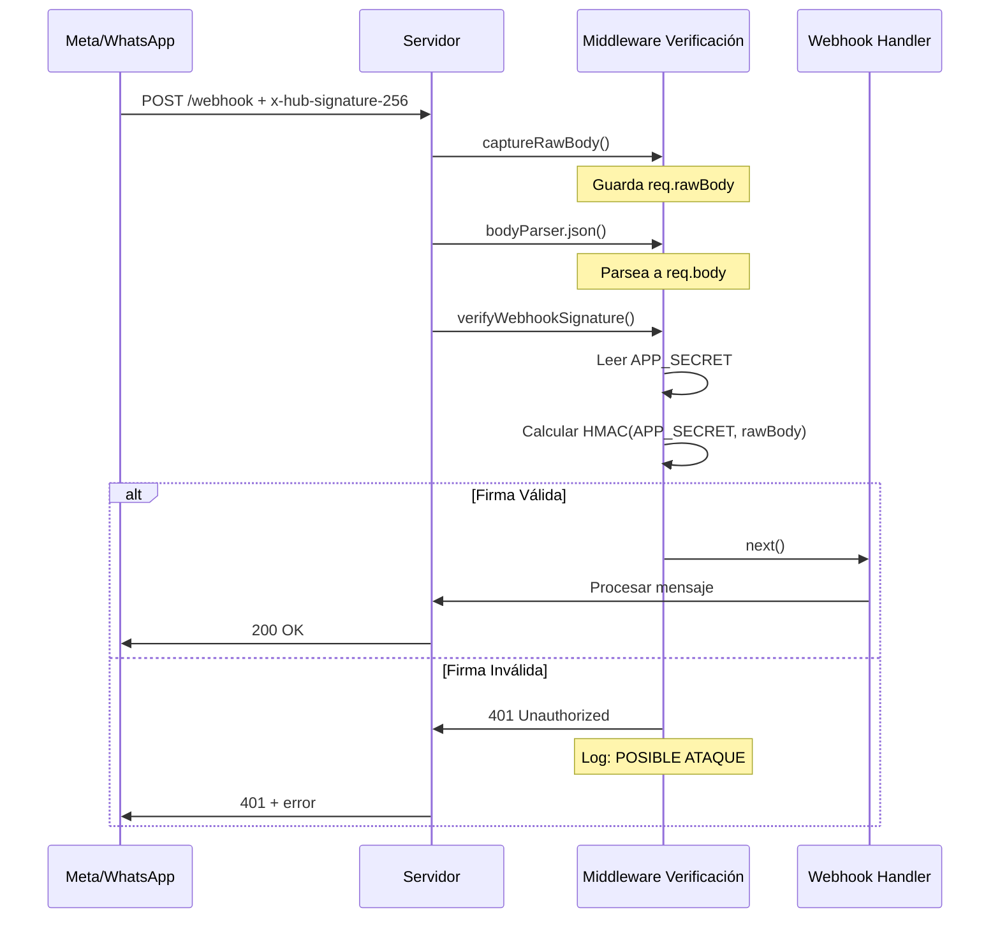

# Seguridad de Webhook - Verificación de Firma HMAC SHA256

## 📋 Resumen

Sistema de verificación de firma de webhooks implementado para garantizar que todos los mensajes recibidos provengan **auténticamente de Meta/WhatsApp** y no de atacantes intentando enviar webhooks falsos.

## 🔒 Problema Resuelto

### Escenario de Ataque Sin Verificación

```
Atacante → POST /webhook → Servidor → ❌ Procesa webhook falso
             {
               "messages": [{
                 "from": "victima",
                 "text": "Transferí $1000"
               }]
             }
```

**Consecuencias**:
- ❌ Inyección de pedidos falsos
- ❌ Manipulación de estados de conversación
- ❌ Spam masivo a clientes
- ❌ Extracción de información sensible

### Con Verificación de Firma ✅

```
Atacante → POST /webhook → Servidor → Verifica firma → ❌ 401 Unauthorized
Meta     → POST /webhook → Servidor → Verifica firma → ✅ Procesa webhook
             Header: x-hub-signature-256: sha256=abc123...
```

## 🎯 Implementación

### 1. Middleware de Verificación
**Archivo**: `src/middleware/webhookVerification.js`

```javascript
export function verifyWebhookSignature(req, res, next) {
  const APP_SECRET = process.env.APP_SECRET;
  
  // 1. Obtener firma del header
  const signature = req.get('x-hub-signature-256');
  // Formato: "sha256=<hash_hmac_sha256>"
  
  // 2. Calcular hash esperado del payload
  const expectedHash = crypto
    .createHmac('sha256', APP_SECRET)
    .update(req.rawBody)
    .digest('hex');
  
  // 3. Comparar firmas usando timingSafeEqual
  //    (previene timing attacks)
  if (!crypto.timingSafeEqual(
    Buffer.from(signature),
    Buffer.from(`sha256=${expectedHash}`)
  )) {
    logger.error('🚨 FIRMA INVÁLIDA - POSIBLE ATAQUE');
    return res.status(401).json({ error: 'Invalid signature' });
  }
  
  // ✅ Firma válida
  next();
}
```

**Características**:
- ✅ Verificación HMAC SHA256 según estándar de Meta
- ✅ Protección contra timing attacks con `crypto.timingSafeEqual()`
- ✅ Logging detallado de intentos no autorizados
- ✅ Captura de IP y User-Agent de atacantes
- ✅ Modo desarrollo sin bloqueo (warning si APP_SECRET no configurado)

### 2. Captura de Raw Body
**Problema**: Express JSON parser modifica el body, pero necesitamos el string original para calcular el hash.

**Solución**: Middleware `captureRawBody()` ejecutado ANTES del parser.

```javascript
// app.js
app.use(bodyParser.json({ 
  verify: captureRawBody // Ejecuta ANTES de parsear
}));

// captureRawBody guarda el body original
export function captureRawBody(req, res, buf, encoding) {
  if (buf && buf.length) {
    req.rawBody = buf.toString(encoding || 'utf8');
  }
}
```

### 3. Integración en Rutas
**Archivo**: `src/routes/webhook.js`

```javascript
import { verifyWebhookSignature } from '../middleware/webhookVerification.js';

// GET sin firma (verificación inicial con Meta)
router.get('/', verifyWebhookHandler);

// POST CON firma (mensajes reales)
router.post('/', verifyWebhookSignature, messageWebhookHandler);
```

### 4. Validación al Inicio
**Archivo**: `app.js`

```javascript
import { validateWebhookSecurityConfig } from '../middleware/webhookVerification.js';

async function initApp() {
  // ...
  logger.info('🔐 Validando configuración de seguridad...');
  validateWebhookSecurityConfig();
  // ...
}
```

Verifica al iniciar el servidor:
- ✅ APP_SECRET configurado (crítico en producción)
- ✅ Longitud mínima de 32 caracteres
- ⚠️ Advierte si está deshabilitado en desarrollo

## 🔧 Configuración

### 1. Obtener APP_SECRET de Meta

1. Ve a [Meta for Developers](https://developers.facebook.com/)
2. Selecciona tu App
3. **Settings** → **Basic**
4. Copia **App Secret** (botón "Show")

**⚠️ IMPORTANTE**: NO compartas este secret públicamente, es equivalente a una contraseña.

### 2. Configurar en .env

```bash
# App Secret de Meta para verificación de firma de webhooks (CRÍTICO)
# Obtener desde: Meta App Dashboard > App Settings > Basic > App Secret
APP_SECRET=tu_app_secret_aqui_32_caracteres_minimo
```

**Generar Secret Temporal (Desarrollo)**:
```bash
node -e "console.log(require('crypto').randomBytes(32).toString('hex'))"
```

### 3. Reiniciar Servidor

```bash
npm start
```

Verás en los logs:
```
🔐 Validando configuración de seguridad...
✅ Verificación de firma de webhook habilitada
   APP_SECRET configurado (64 caracteres)
```

## 🧪 Pruebas

### Test 1: Webhook SIN Firma (Bloqueado)

```bash
curl -X POST http://localhost:3000/webhook \
  -H "Content-Type: application/json" \
  -d '{"object":"whatsapp_business_account","entry":[]}'
```

**Resultado Esperado**:
```
HTTP 401 Unauthorized
{"success":false,"error":"No signature header present"}
```

**Logs del Servidor**:
```
🚨 WEBHOOK SIN FIRMA - Request bloqueado
   IP: ::1
   User-Agent: curl/7.68.0
```

### Test 2: Webhook con Firma INCORRECTA (Bloqueado)

```bash
curl -X POST http://localhost:3000/webhook \
  -H "Content-Type: application/json" \
  -H "x-hub-signature-256: sha256=firma_falsa_12345" \
  -d '{"object":"whatsapp_business_account","entry":[]}'
```

**Resultado Esperado**:
```
HTTP 401 Unauthorized
{"success":false,"error":"Invalid signature"}
```

**Logs del Servidor**:
```
🚨 FIRMA INVÁLIDA - Signature mismatch
   Esperada: sha256=a1b2c3...
   Recibida: sha256=firma_falsa_12345
   IP: ::1
   ⚠️ POSIBLE ATAQUE: Intento de webhook no autorizado detectado
```

### Test 3: Webhook con Firma CORRECTA (Permitido)

Para calcular la firma correcta:

```javascript
const crypto = require('crypto');
const APP_SECRET = 'tu_app_secret';
const payload = '{"object":"whatsapp_business_account","entry":[]}';

const signature = 'sha256=' + crypto
  .createHmac('sha256', APP_SECRET)
  .update(payload)
  .digest('hex');

console.log('Firma:', signature);
```

```bash
curl -X POST http://localhost:3000/webhook \
  -H "Content-Type: application/json" \
  -H "x-hub-signature-256: sha256=<firma_calculada>" \
  -d '{"object":"whatsapp_business_account","entry":[]}'
```

**Resultado Esperado**:
```
HTTP 200 OK
{"status":"received"}
```

**Logs del Servidor**:
```
✅ Firma de webhook verificada correctamente
ℹ️ Webhook recibido: whatsapp_business_account
```

## 📊 Flujo de Verificación



## 🚨 Logs de Seguridad

### Webhook Sin Firma
```log
[ERROR] 🚨 WEBHOOK SIN FIRMA - Request bloqueado
[ERROR]    IP: 192.168.1.100
[ERROR]    User-Agent: python-requests/2.28.0
```

### Firma Inválida
```log
[ERROR] 🚨 FIRMA INVÁLIDA - Signature mismatch
[ERROR]    Esperada: sha256=a1b2c3d4e5f6...
[ERROR]    Recibida: sha256=malicious_hash
[ERROR]    IP: 10.20.30.40
[ERROR]    User-Agent: malicious-bot/1.0
[ERROR]    ⚠️ POSIBLE ATAQUE: Intento de webhook no autorizado detectado
```

### APP_SECRET No Configurado (Desarrollo)
```log
[WARN] ⚠️ APP_SECRET no configurado (modo desarrollo)
[WARN]    Verificación de firma de webhook deshabilitada
[WARN]    Para habilitar, agrega APP_SECRET a .env
```

### APP_SECRET No Configurado (PRODUCCIÓN)
```log
[ERROR] 🚨 CONFIGURACIÓN CRÍTICA FALTANTE: APP_SECRET no está configurado
[ERROR]    La verificación de firma de webhook está DESHABILITADA
[ERROR]    Esto es un riesgo de seguridad CRÍTICO en producción
[ERROR]    Configura APP_SECRET en .env inmediatamente
```

## 🛡️ Garantías de Seguridad

1. **Autenticidad**: Solo Meta puede generar firmas válidas (conoce APP_SECRET)
2. **Integridad**: Cualquier modificación del payload invalida la firma
3. **No Repudio**: El hash HMAC garantiza que Meta envió ese mensaje específico
4. **Timing Attack Resistant**: Uso de `crypto.timingSafeEqual()` previene ataques de tiempo

## 🔄 Comparación: Antes vs Después

### ❌ ANTES (Sin Verificación)

```javascript
// ⚠️ PELIGRO: Cualquiera puede enviar webhooks
router.post('/', messageWebhookHandler);

// Atacante puede enviar:
POST /webhook
{ "messages": [{ "from": "+123", "text": "Pedido falso" }] }
// ✅ Procesado sin validación
```

### ✅ DESPUÉS (Con Verificación)

```javascript
// 🔒 SEGURO: Solo Meta puede enviar webhooks válidos
router.post('/', verifyWebhookSignature, messageWebhookHandler);

// Atacante intenta:
POST /webhook
{ "messages": [{ "from": "+123", "text": "Pedido falso" }] }
// ❌ 401 Unauthorized - Firma ausente o inválida

// Meta envía:
POST /webhook
x-hub-signature-256: sha256=<hash_válido>
{ "messages": [...] }
// ✅ Procesado correctamente
```

## 📈 Monitoreo Recomendado

### Alertas a Configurar

1. **Intentos de Webhook Sin Firma** (frecuencia > 10/hora)
   - Posible escaneo de vulnerabilidades
   - Acción: Bloquear IP en firewall

2. **Intentos con Firma Inválida** (cualquier ocurrencia)
   - Intento de ataque directo
   - Acción: Alerta inmediata al equipo de seguridad

3. **APP_SECRET No Configurado en Producción** (al iniciar servidor)
   - Configuración crítica faltante
   - Acción: Bloquear despliegue hasta configurar

### Queries de Log Útiles

```bash
# Contar intentos no autorizados en última hora
grep "POSIBLE ATAQUE" logs/*.log | wc -l

# Ver IPs de atacantes
grep "FIRMA INVÁLIDA" logs/*.log | grep -oP "IP: \K[0-9.]+"

# Verificar configuración al inicio
grep "APP_SECRET configurado" logs/*.log | tail -1
```

## 🔗 Referencias

- [Meta Webhook Signature Validation](https://developers.facebook.com/docs/graph-api/webhooks/getting-started#verification-requests)
- [HMAC Authentication Best Practices](https://en.wikipedia.org/wiki/HMAC)
- [Node.js Crypto Module](https://nodejs.org/api/crypto.html)
- [Timing Attack Prevention](https://en.wikipedia.org/wiki/Timing_attack)

## ⚠️ Consideraciones de Despliegue

### Desarrollo Local
- ✅ Opcional: Puede funcionar sin APP_SECRET (warnings en logs)
- ✅ Útil para pruebas sin configurar Meta App completa

### Staging
- ⚠️ Recomendado: Configurar APP_SECRET real
- ⚠️ Usar mismo secret que producción o uno dedicado

### Producción
- 🚨 **OBLIGATORIO**: Configurar APP_SECRET
- 🚨 **CRÍTICO**: Usar APP_SECRET de la Meta App en producción
- 🚨 **NO usar** secrets generados aleatoriamente (Meta no los conocerá)
- 🚨 Configurar alertas de intentos no autorizados

### Rotación de Secrets
Si necesitas cambiar APP_SECRET:
1. Genera nuevo secret en Meta App Dashboard
2. Actualiza .env con nuevo secret
3. Reinicia servidor
4. Verifica logs: "APP_SECRET configurado (X caracteres)"

---

**Estado**: ✅ Implementado y probado (Sprint 3 - Tarea 2)  
**Seguridad**: 🔒 HMAC SHA256 + Timing Attack Resistant  
**Cobertura**: Todos los webhooks POST protegidos  
**Fecha**: Noviembre 2025
